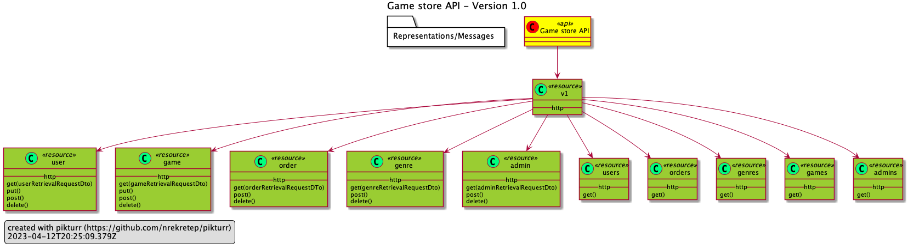

# Online games store API
[](https://github.com/Naereen/StrapDown.js/blob/master/LICENSE)
[](https://github.com/vshymanskyy/StandWithUkraine/blob/main/docs/README.md)

Online game store API, which provides users with a user-friendly interface for browsing and searching an extensive collection of games. Store managers are bestowed with the privilege of seamlessly adding, updating, and deleting games, thereby ensuring optimal flexibility and control over the store's inventory.

The project is based on Spring Boot framework.

The online gaming store is equipped with a host of cutting-edge features, including, but not restricted to:

* ❌ A secure and reliable JWT authorization mechanism. 
* ✅ An extensive documentation conforming to the industry-standard OpenAPI specifications. 
* ✅ Seamless compatibility and integration with GraalVM compilation technology for optimal performance and efficiency. For further information regarding Spring Boot's support for GraalVM, please refer to the following [link](https://spring.io/blog/2022/09/26/native-support-in-spring-boot-3-0-0-m5) 

## Setup

In order to setup the project it's important to have preinstalled **Maven** build tool. Then it's needed to run the following commands:

```shell
mvn clean install

java -jar target/gamestore-0.0.1-SNAPSHOT.jar
```

To generate a native image, executing the following command is imperative:

```shell
mvn -Pnative package
```

The installation of **GraalVM** is a crucial prerequisite that should not be overlooked. 


## Documentation

The subsequent graphical representation is intended to provide a comprehensive illustration of the API that is being depicted in the project.



To gain access to the comprehensive documentation conforming to the **OpenAPI** standard, one can make use of the endpoint exposed by the server itself, denoted by **/v1/docs**. Alternatively, you may utilize its raw JSON interpretation, which can be found in the "docs" directory.
